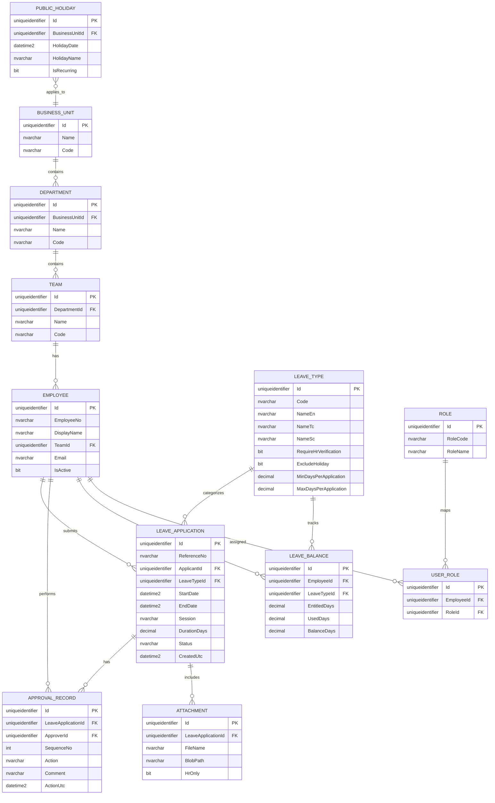

# Entity Relationship Diagram

```mermaid
erDiagram
  BUSINESS_UNIT ||--o{ DEPARTMENT : contains
  DEPARTMENT ||--o{ TEAM : contains
  TEAM ||--o{ EMPLOYEE : has

  EMPLOYEE ||--o{ LEAVE_APPLICATION : submits
  EMPLOYEE ||--o{ APPROVAL_RECORD : performs
  EMPLOYEE ||--o{ LEAVE_BALANCE : owns

  LEAVE_TYPE ||--o{ LEAVE_APPLICATION : categorizes
  LEAVE_TYPE ||--o{ LEAVE_BALANCE : tracks

  LEAVE_APPLICATION ||--o{ APPROVAL_RECORD : has
  LEAVE_APPLICATION ||--o{ ATTACHMENT : includes

  PUBLIC_HOLIDAY }o--|| BUSINESS_UNIT : applies_to

  ROLE ||--o{ USER_ROLE : maps
  EMPLOYEE ||--o{ USER_ROLE : assigned

  BUSINESS_UNIT {
    uniqueidentifier Id PK
    nvarchar Name
    nvarchar Code
  }

  DEPARTMENT {
    uniqueidentifier Id PK
    uniqueidentifier BusinessUnitId FK
    nvarchar Name
    nvarchar Code
  }

  TEAM {
    uniqueidentifier Id PK
    uniqueidentifier DepartmentId FK
    nvarchar Name
    nvarchar Code
  }

  EMPLOYEE {
    uniqueidentifier Id PK
    nvarchar EmployeeNo
    nvarchar DisplayName
    uniqueidentifier TeamId FK
    nvarchar Email
    bit IsActive
  }

  LEAVE_TYPE {
    uniqueidentifier Id PK
    nvarchar Code
    nvarchar NameEn
    nvarchar NameTc
    nvarchar NameSc
    bit RequireHrVerification
    bit ExcludeHoliday
    decimal MinDaysPerApplication
    decimal MaxDaysPerApplication
  }

  LEAVE_BALANCE {
    uniqueidentifier Id PK
    uniqueidentifier EmployeeId FK
    uniqueidentifier LeaveTypeId FK
    decimal EntitledDays
    decimal UsedDays
    decimal BalanceDays
  }

  LEAVE_APPLICATION {
    uniqueidentifier Id PK
    nvarchar ReferenceNo
    uniqueidentifier ApplicantId FK
    uniqueidentifier LeaveTypeId FK
    datetime2 StartDate
    datetime2 EndDate
    nvarchar Session
    decimal DurationDays
    nvarchar Status
    datetime2 CreatedUtc
  }

  APPROVAL_RECORD {
    uniqueidentifier Id PK
    uniqueidentifier LeaveApplicationId FK
    uniqueidentifier ApproverId FK
    int SequenceNo
    nvarchar Action
    nvarchar Comment
    datetime2 ActionUtc
  }

  ATTACHMENT {
    uniqueidentifier Id PK
    uniqueidentifier LeaveApplicationId FK
    nvarchar FileName
    nvarchar BlobPath
    bit HrOnly
  }

  PUBLIC_HOLIDAY {
    uniqueidentifier Id PK
    uniqueidentifier BusinessUnitId FK
    datetime2 HolidayDate
    nvarchar HolidayName
    bit IsRecurring
  }

  ROLE {
    uniqueidentifier Id PK
    nvarchar RoleCode
    nvarchar RoleName
  }

  USER_ROLE {
    uniqueidentifier Id PK
    uniqueidentifier EmployeeId FK
    uniqueidentifier RoleId FK
  }
```

